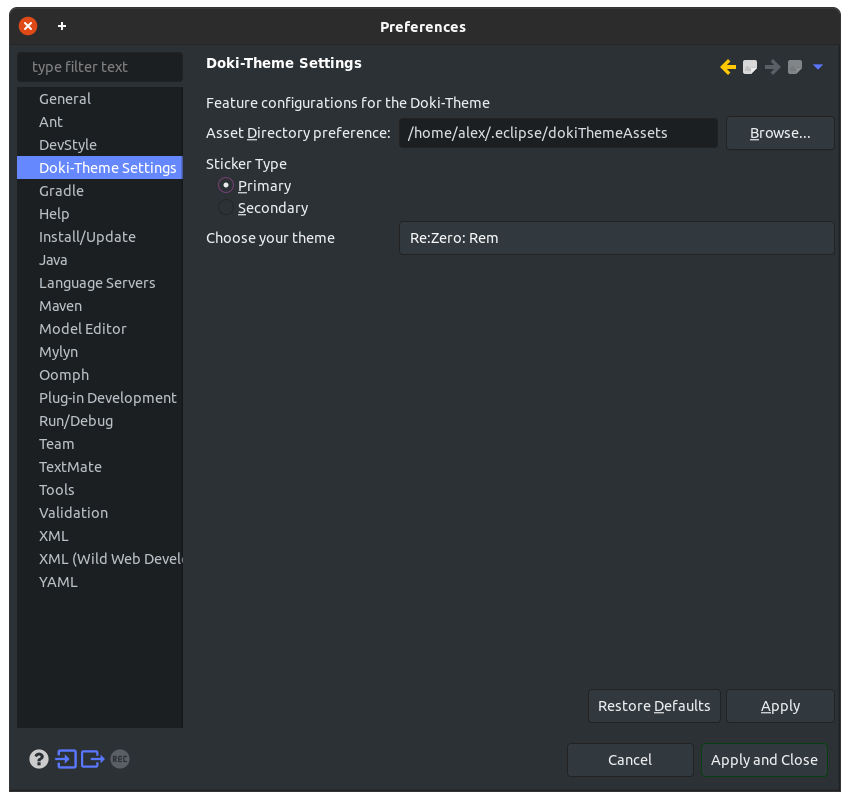

The Doki Theme: Eclipse IDE
---

## Quick Theme Preview

---

# Pre-Requisites for best experience

- [Eclipse 4.17.0+](https://www.eclipse.org/) IDE installed on your system.
- [Darkest Dark](https://marketplace.eclipse.org/content/darkest-dark-theme-devstyle) plugin from the Eclipse Marketplace.

# Installation

This plugin is available from my plugin update site:

[https://eclipse.assets.unthrottled.io/doki-theme/](https://eclipse.assets.unthrottled.io/doki-theme/)

You can go to `Help > Install New Software` and add this site to install the plugin. 

**Be sure to watch this repository for releases!** 
That way you know when to check for updates.

# Theme Setup

The current version of the Doki Theme for Eclipse leverages the look and feel of the [Darkest Dark](https://marketplace.eclipse.org/content/darkest-dark-theme-devstyle) plugin.
The Eclipse platform's theme development experience is currently dark, scary, and very arcane. 
In order to give you the best developer experience sooner, let's just take a quick shortcut!

(The future 1.0.0 release will contain the fully bundled color experience without needing DevStyles colors)

## Look and Feel Setup

You have a couple of options here friend! You can opt to use:

- The bundled look and feels from DevStyle
- The custom color theme

**Bundled looks and feels**

To save you some work, here are waifus that go best with each of the bundled themes

| Dev Style | Waifu |
| --- | --- |
| Dark Gray (Darkest Dark) | Rem, Ryuko, Rin |
| Deep Black | Darkness Dark, Ishtar Dark, Rory |
| Dark Blue | Sayori Dark, Kanna, Aqua, Rem |
| Dark Green | Just Monika, Hatsune Miku |
| Dark Red | Rias |
| Dark Purple | Emilia Dark, Yuri Dark, Misato |
| Light Gray | Satsuki, Asuna |
| Light Blue | Sayori Light |
| Light Red | <No body> |
| Light Green | Monika Light |
| Light Purple | Emilia Light, Yuri Light |

> Note: `Window > Preferences > DevStyle > Color Theme` is the DevStyle Customization window.

**Custom color theme**

DevStyle also supplies the ability to customize a `Light Custom` and `Dark Custom`, by providing an HSL color.
Unfortunately, it does not respect the HSL value completely, because it does not match the exact color.

However, for some themes, it does look close enough to the original color.
So if you're feeling adventurous, go for this route!

For your convenience, I have provided the `devStyleThemes` directory in this repository.
This directory contains all the current supported Doki Themes. 

The directory includes a file whose name is base HSL value you can use to set the Light/Dark custom theme to.

Example Directory: [Kanna](https://github.com/doki-theme/doki-theme-eclipse/tree/master/devStyleThemes/DM:%20Kanna)

## Syntax Coloring

Unfortunately, the out-of-the-box syntax coloring for DevStyle, is not the greatest.
It will not be very consistent with the other themes on other platforms.

The plugin will eventually supply its own automatic syntax coloring in the `1.0.0` release!
However, this gives us the Doki Theme now, so I can't complain too much :)

> Note: `Window > Preferences > DevStyle > Color Theme` is the DevStyle Customization window.

Like I said above (if you read that part), I have provided the `devStyleThemes` directory in this repository.
This directory contains all the current supported Doki Themes.

The directory includes a xml file which you can [download](https://webapps.stackexchange.com/a/87957) and `import` and apply as your `Editor Theme`.

Example Directory: [Kanna](https://github.com/doki-theme/doki-theme-eclipse/tree/master/devStyleThemes/DM:%20Kanna)

## Stickers!

The best feature that **every** IDE needs!

The sticker is available from the `Doki Sticker` view, which opens a window with your current theme's waifu.
You can find this by using the `Find Actions` shortcut (default `ctrl+3` or `ctrl+shift+a` if you have IntelliJ shortcuts installed!)and search for `Doki`, you should find the relevant settings and view doing that.

If you don't feel like being fancy, you can find it via `Window > Show View > Other` and just type `doki` and you'll find the relevant view!

Feel free to place the sticker where you want to after that.

## Settings

> `Window > Preferences > Doki-Theme Settings`

Hey alright! You can customize your Doki-Theme settings.

**Asset Directory Preference**

The Doki-Theme downloads your waifu so that she may be available offline.
You have the ability to customize the location where your waifu is downloaded.

> Note: The plugin will overwrite the image if it has detected that the image has changed
> (just in-case you were trying to be clever, I'd save you some time).

**Sticker Type**

Some theme's have more than one sticker. 
This setting enables you to switch between one another.

**Choose Your Theme**

This give you the ability to change what sticker is currently present in you `Doki Sticker` view

# About!

This plugin is for serious Otaku programmers.
Code with your waifu. With over **20** themes,
I think you will find best girl.

You can choose themes from various, Anime, Manga, or Visual Novels:

- Doki-Doki Literature Club
- Re:Zero
- Kill La Kill
- KonoSuba
- DanganRonpa
- High School DxD
- Lucky Star
- Sword Art Online
- Neon Genesis Evangelion
- Fate
- Gate
- Miss Kobayashi's Dragon Maid

## Contributing

If you want to get your workstation set up to work on the plugin,
then you'll want to check out the [CONTRIBUTING.md](./CONTRIBUTING.md) for instructions on what is needed.

# Got Fun ideas, or issues?

Don't be afraid to reach out and submit [an issue](https://github.com/doki-theme/doki-theme-eclipse/issues/new)!

## Enjoying the plugin and want more people to use it?

Great! I am glad you like it!

Be sure to share it with others who also may like it as well!

## Not your thing or something bothering you?

Feel free to submit your feedback as [an issue](https://github.com/doki-theme/doki-theme-eclipse/issues/new).
Help make this plugin better!

## Are you sure you really want to use Eclipse??

The Doki Theme is also available for [Jetbrains IDEs](https://github.com/doki-theme/doki-theme-jetbrains), such as IntelliJ!! `/rant`

---

    </img>

