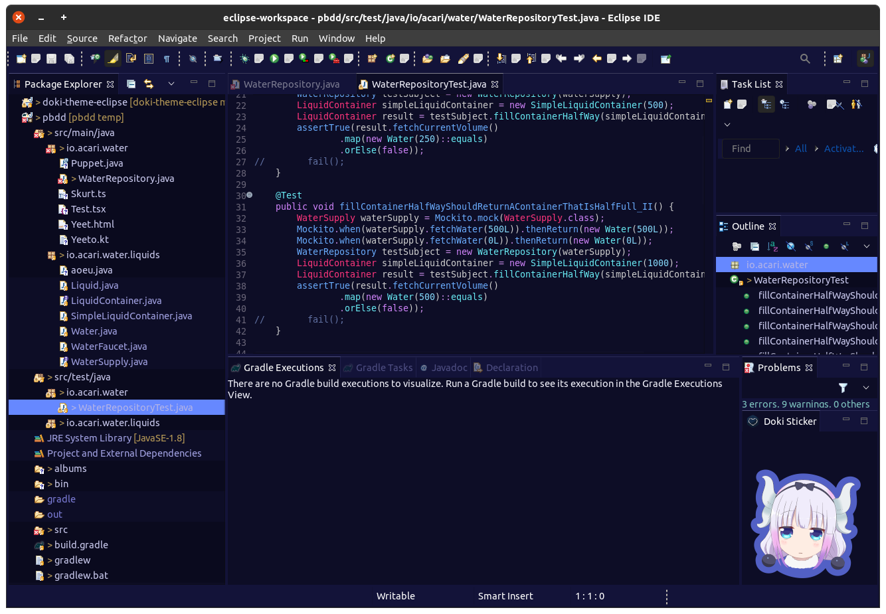

The Doki Theme: Eclipse IDE
---

## Quick Theme Preview

---

This plugin is for serious Otaku programmers.
Code with your waifu. With over **20** themes,
I think you will find best girl.

You can choose themes from various, Anime, Manga, or Visual Novels:

- Doki-Doki Literature Club
- Re:Zero
- Kill La Kill
- KonoSuba
- DanganRonpa
- High School DxD
- Lucky Star
- Sword Art Online
- Neon Genesis Evangelion
- Fate
- Gate
- Miss Kobayashi's Dragon Maid

# Got Contributions, fun ideas, or issues?

Don't be afraid to reach out and submit [an issue](https://github.com/doki-theme/doki-theme-eclipse/issues/new)!

## Enjoying the plugin and want more people to use it?

Great! I am glad you like it!

Be sure to share it with others who also may like it as well!

## Not your thing or something bothering you?

Feel free to submit your feedback as [an issue](https://github.com/doki-theme/doki-theme-eclipse/issues/new).
Help make this plugin better!

---

    </img>

